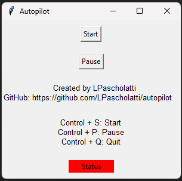

**Autopilot App**

Intended to keep the OS alive (currently only windows), preserving the screen from getting locked when AFK, moving the mouse and pressing Alt + Tab while you are drinking a coffee or relaxing away from keyboard but still want to read messages or emails coming from work.

Programmed in Python using pyautogui and tkinter.

Requirements:

- Python
- Pyautogui
- Tkinter

Suggested: start a new virtual env in the main directory after cloning this repo.

Install all required modules using `requirements.txt`.

Run with python via `main.py`.

Or, you can generate a windows distro by running pyinstaller.

By LPascholatti https://github.com/LPascholatti/autopilot
